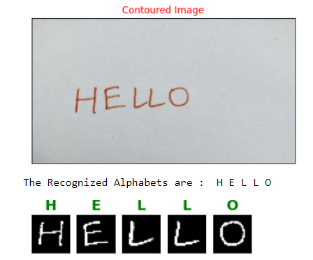
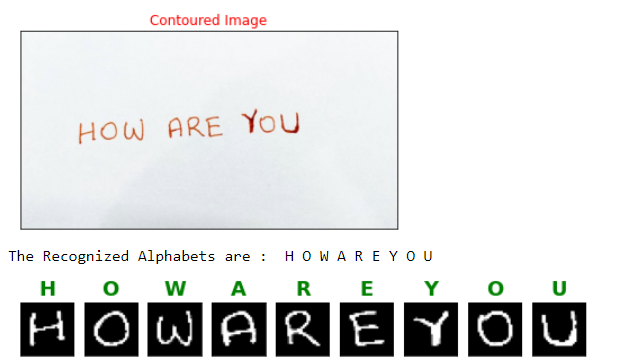
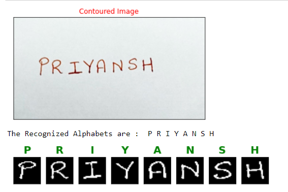

# Handwritten-Alphabets-Recognition
This code helps you recognize Handwritten English Alphabets using Convnets with an accuracy above 99%

Handwritten A-Z Alphabet Dataset from Kaggle was used to train the model. It was further used to develop a program to recognize Handwritten Text on paper and is totally suitable for real-life examples. The dataset had 3,72,450 (28x28 px) images with 26 Labels (A-Z). Out of these 0.1% was used for validation and testing each.

Keras API with Tensorflow in the backend was used to build the Deep Neural Network. OpenCV was used to detect multiple alphabets in a single image using Contours.

Training Accuracy: 99.02%

Validation Accuracy: 99.19%

Test Accuracy: 99.44%

## Getting Started

### Dependencies

* Jupyter Notebook required

* Python Libraries

    - Imutils
    - Tensorflow
    - Keras
    - Numpy
    - cv2
    - os
    - Scikit-Learn
    - Matplotlib

### Installing

* Download Jupyter Notebook

* No further installation

### Executing program

There are 4 phases of this program, run each of them.

* Train a Deep Convolutional Neural Network to recognize Hand-written Alphabets A-Z (Capital Letters).
* Take a Test image with capital alphabets written on a White plain sheet. 
* Localize and Detect multiple Alphabets in the in the Binary Threshold image using Contours Detection method of OpenCV 
* Classify the selected Contours using the Trained DCNN model

## Help

Installing the libraries beforehand will solve most issues

## Authors

Contributors names and contact info 
ex. [@priyanshkedia04](https://github.com/priyanshkedia04)

## Version History

* 0.1
    * Initial Release

## License

GNU General Public License v3.0
